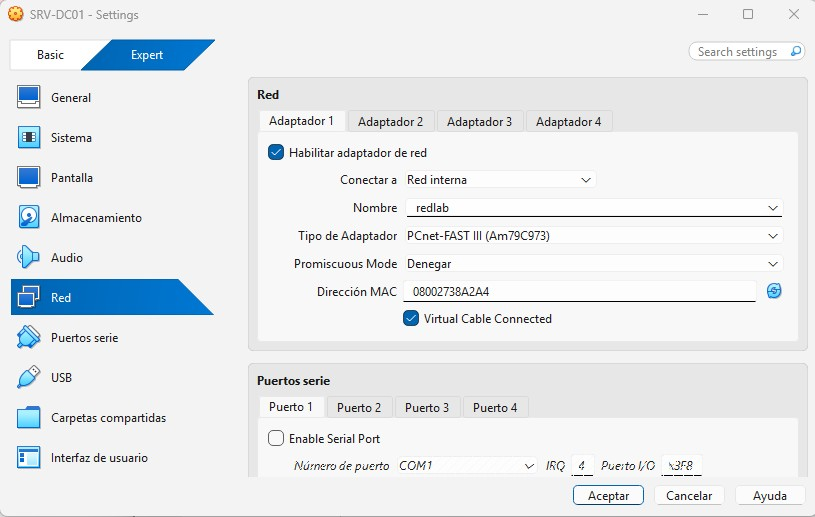

# 01. Servidor: Instalación y Configuración (Bloque A)

## 1. Configuración de la Máquina Virtual
Se creó la VM **SRV-DC01** en VirtualBox con 4 GB de RAM y 50 GB de disco. Se configuró el Adaptador 1 en **Red interna** con nombre `redlab`.

## 2. Instalación de Windows Server 2025
Se instaló la versión Standard (Experiencia de escritorio) en español.

## 3. Asignación de Nombre de Equipo
En Administrador del servidor, se renombró el equipo a:
* **Nombre:** `SRV-DC01`

## 4. Configuración de IP Fija
Se configuró la red con los parámetros solicitados:
* **IP:** `192.168.10.10`
* **Máscara:** `255.255.255.0`
* **DNS Preferido:** `127.0.0.1`

## 5. Verificación de Firewall
Se comprobó que el firewall de Windows está activo por defecto.
