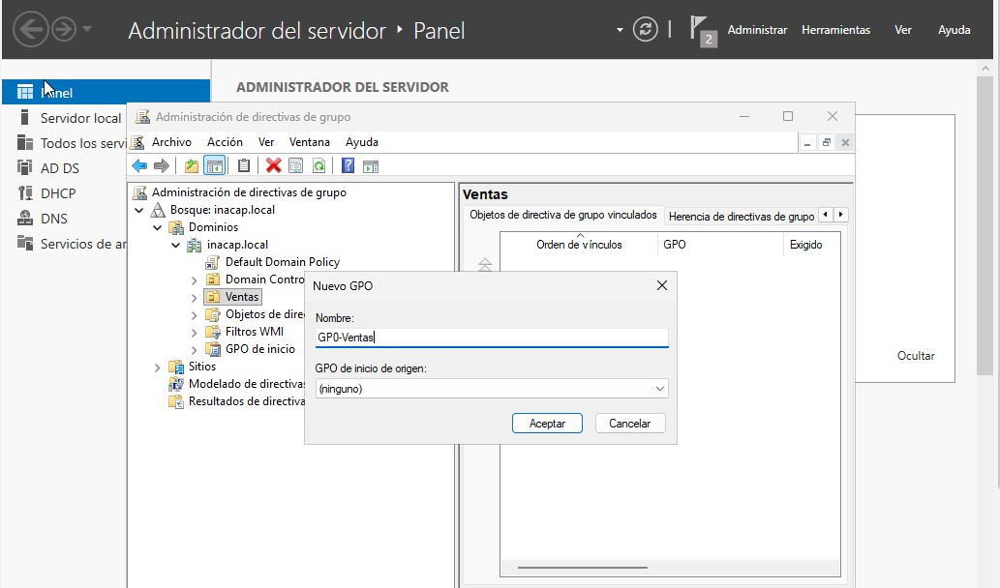

Se creó y vinculó el objeto de directiva de grupo GPO-Ventas en la Unidad Organizativa correspondiente.

Para qué sirve: Las GPOs (Group Policy Objects) son el mecanismo central de Windows Server para definir configuraciones estandarizadas a nivel de SO y aplicaciones. Al vincular el GPO a la OU Ventas, aseguramos que todas las restricciones y configuraciones se apliquen de forma automática y jerárquica a todos los usuarios contenidos en dicho contenedor.

19. Configuración de Restricciones
Se editó el GPO para aplicar una restricción de usuario que impide el acceso a herramientas de configuración.

Política: "Prohibir el acceso a Configuración de PC y a Panel de control" configurada como Habilitada.

Para qué sirve: Esta restricción es una medida de "fortalecimiento" (hardening) del puesto de trabajo. Al bloquear el acceso al Panel de Control y Configuración, evitamos modificaciones no autorizadas por parte de los usuarios, lo que garantiza la estabilidad de la configuración corporativa y reduce significativamente el riesgo de alteraciones malintencionadas o accidentales.

20. Aplicación y Verificación
Tras forzar la actualización de directivas en el cliente, se verificó el bloqueo del acceso al intentar abrir el Panel de Control.

Para qué sirve: La ejecución de gpupdate /force es el paso esencial para forzar al cliente a solicitar las nuevas políticas al controlador de dominio sin esperar el intervalo de refresco automático. La verificación final confirma que la jerarquía de dominios, el servicio de DNS y la lógica de directivas están funcionando en perfecta sincronía.